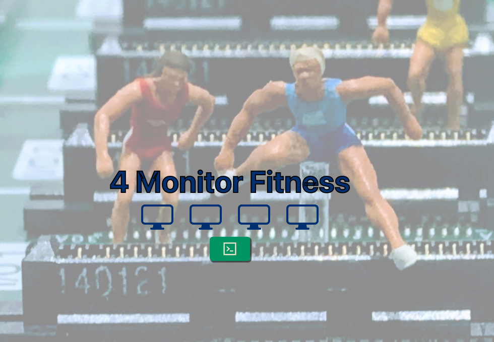
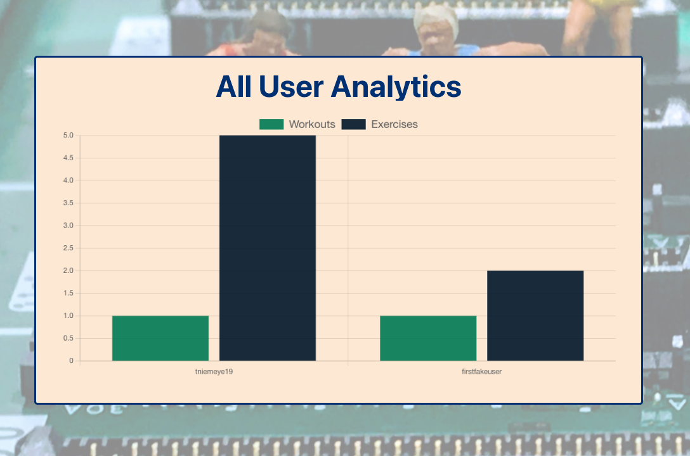

# 4-Monitor-Fitness
## Description  
    
  A website designed for those that want to stay active but spend most of their day in a chair. Organize and store your exercises in workouts to achieve maximum gains today!
  ## Table of Contents
  * [Installation](#installation)
  * [Usage](#usage)
  * [Screenshots](#screenshots)
  * [License](#license)
  * [Questions](#questions)
  ## Installation
  Simply go to https://cryptic-depths-93627.herokuapp.com/ to use the deployed application.
  ## Usage
  Users can signup to be able to search for exercises based on equipment, and add exercises to their own custom workouts. Users can also see their data displayed in graphs.
  ## Screenshots
  Landing Page
  

  Data Analytics
  

  ## License
  <a href='https://opensource.org/licenses/unlicense' target='_blank'>The Unlicensed</a>
  ## Questions
  If you have questions you can:  
  * Contact me on Github at [github.com/john-harris-iii](https://github.com/john-harris-iii) 